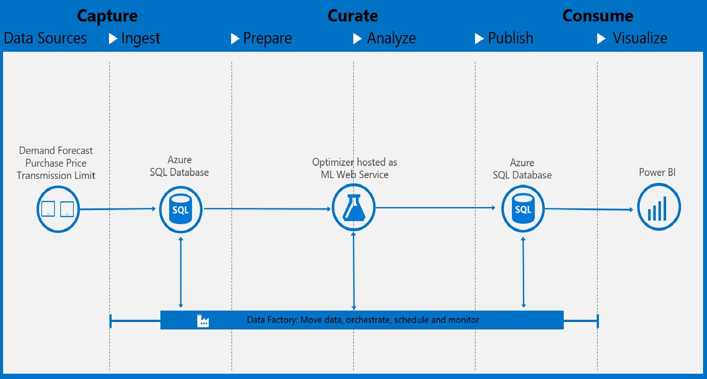

# Energy Supply Optimization Solution in Cortana Intelligence Suite

## Table of Contents  
- [Abstract](#abstract)  
- [Requirements](#requirements)
- [Architecture](#architecture)
- [Setup Steps](#setup-steps)
- [Validation and Results](#validation-and-results)

## Abstract[RL]
This solution focuses on demand forecasting within the energy sector. Storing energy is not cost-effective, so utilities and power generators need to forecast future power consumption so that they can efficiently balance the supply with the demand. During peak hours, short supply can result in power outages. Conversely, too much supply can result in waste of resources. Advanced demand forecasting techniques detail hourly demand and peak hours for a particular day, allowing an energy provider to optimize the power generation process. This solution using Cortana Intelligence enables energy companies to quickly introduce powerful forecasting technology into their business.

This solution combines several Azure services to provide powerful advantages. Event Hubs collects real-time consumption data. Stream Analytics aggregates the streaming data and makes it available for visualization. Azure SQL stores and transforms the consumption data. Machine Learning implements and executes the forecasting model. Power BI visualizes the real-time energy consumption as well as the forecast results. Finally, Data Factory orchestrates and schedules the entire data flow.


The published [Energy Demand Forecast Solution](https://go.microsoft.com/fwlink/?linkid=831187) provides one-click deployment of an energy demand forecast solution in Cortana Intelligence Suite. Advanced analytics solution implementers, i.e. Data Scientists and Data Engineers, usually need deeper understanding of the template components and architecture in order to use, maintain, and improve the solution. This documentation provides more details of the solution and step-by-step deployment instructions. Going through this manual deployment process will help implementers gain an inside view on how the solution is built and the function of each component.

## Requirements[PS]

You will need the following accounts and software to create this solution:

- Source code and instructions from this GitHub repo

- A [Microsoft Azure subscription](<https://azure.microsoft.com/>)

- An [Azure Machine Learning Studio account](<http://studio.azureml.net>)

- A Microsoft Office 365 subscription for Power BI access

- A network connection

- [SQL Server Management Studio](<https://msdn.microsoft.com/en-us/library/mt238290.aspx>), [Visual Studio](<https://www.visualstudio.com/en-us/visual-studio-homepage-vs.aspx>), or another similar tool to access a SQL server database.

- [Microsoft Azure Storage Explorer](<http://storageexplorer.com/>)

- [Power BI Desktop](<https://powerbi.microsoft.com/en-us/desktop>)

It will take about one day to implement this solution if you have all the required software/resources ready to use. 

## Architecture


The figure above shows the overall architecture of the Energy Supply Optimization solution.

- The data is simulated from **Azure Web Jobs** and feeds into the **Azure SQL Database**.

- **Azure Machine Learning** service is used to optimize the energy supply of particular region given the inputs received.

- **Azure SQL Database** is used to store the prediction results received from the **Azure Machine Learning** service.

- **Azure Data Factory** handles orchestration, and scheduling of the hourly model retraining and reforecasting.

- Finally, **Power BI** is used for results visualization.

This architecture is an example that demonstrates one way of building energy supply optimization solution in Cortana Intelligence Suite. User can modify the architecture and include other Azure services based on different business needs.

## Setup Steps
This section walks the readers through the creation of each of the Cortana Intelligence Suite services in the architecture defined in Figure 1.
As there are usually many interdependent components in a solution, Azure Resource Manager enables you to group all Azure services in one solution into a [resource group](https://azure.microsoft.com/en-us/documentation/articles/resource-group-overview/#resource-groups). Each component in the resource group is called a resource.
We want to use a common name for the different services we are creating. The remainder of this document will use the assumption that the base service name is:

energyopttemplate\[UI\]\[N\]

Where \[UI\] is the users initials and N is a random integer that you choose. Characters must be entered in in lowercase. Several services, such as Azure Storage, require a unique name for the storage account across a region and hence this format should provide the user with a unique identifier.
So for example, Steven X. Smith might use a base service name of *energyopttemplatesxs01*  

**NOTE:** We create most resources in the South Central US region. The resource availability in different regions depends on your subscription. When deploying you own resources, make sure all data storage and compute resources are created in the same region to avoid inter-region data movement. Azure Resource Group and Azure Data Factory don’t have to be in the same region as the other resources. Azure Resource Group is a virtual group that groups all the resources in one solution. Azure Data Factory is a cloud-based data integration service that automates the movement and transformation of data. Data factory orchestrates the activities of the other services.


### 1. Create a new Azure Resource Group

  - Navigate to ***portal.azure.com*** and log in to your account

  - On the left tab click ***Resource Groups***

  - In the resource groups page that appears, click ***Add***

  - Provide a name ***energyopttemplate\_resourcegroup***

  - Select a ***location***. Note that resource group is a virtual group that groups all the resources in one solution. The resources don’t have to be in the same location as the resource group itself.

  - Click ***Create***

### 2. Setup Azure Storage account

An Azure Storage account is used by the Azure Machine Learning workspace.

  - Navigate to ***portal.azure.com*** and log in to your account.

  - On the left tab click ***+ (New) > Storage > Storage Account***

  - Set the name to ***energyopttemplate[UI][N]***

  - Change the ***Deployment Model*** to ***Classic***

  - Set the resource group to the resource group we created by selecting the radio button ***Use existing***

  -  Location set to South Central US

  - Click ***Create***

  - Wait for the storage account to be created

Now that the storage account has been created we need to collect some information about it for other services like Azure Data Factory.

  - Navigate to ***portal.azure.com*** and log in to your account

  - On the left tab click Resource Groups

  - Click on the resource group we created earlier ***energyopttemplate_resourcegroup***. If you don’t see the resource group, click ***Refresh***

  - Click on the storage account in Resources

  - In the Settings tab on the right, click ***Access Keys***

  - Copy the PRIMARY CONNECTION STRING and add it to the table below

  - Copy the Primary access key and add it to the table below

    | **Azure Storage Account** |                     |
    |------------------------|---------------------|
    | Storage Account        |energyopttemplate\[UI][N]|
    | Connection String      |             |
    | Primary access key     |             ||

### 3. Setup Azure SQL Server and Database

In this step, we will create an Azure SQL Database to store “actual” demand data generated by the data generator and forecasted demand data generated by Azure Machine Learning experiment. The data in Azure SQL Database are consumed by Power BI to visualize optimize results and performance.

#### 1) Create Azure SQL Server and Database

- Navigate to ***portal.azure.com*** and login in to your account

- On the left tab click ***+ (New) > Databases > SQL Database***

- Enter the name ***energyopttemplatedb*** for the database name

- Choose the resource group previously created ***energyopttemplate_resourcegroup***

- Under Server click the arrow and choose ***Create new server***
    - Name : energyopttemplate\[UI][N]

    - Enter in an administrator account name and password and save it to the table below.

    - Choose South Central US as the location to keep the SQL database in the same region as the rest of the services.

    - Click **Select**

- Once returned to the SQL Database tab, click ***Create***

- Wait for the database and server to be created. This may take few minutes.

- From ***portal.azure.com***, click on Resource Groups, then the group for this demo ***energyopttemplate_resourcegroup***.

- In the list of resources, click on the SQL Server that was just created.

- Under ***Settings*** for the new server, click ***Firewall*** and create a rule called ***open*** with the IP range of 0.0.0.0 to 255.255.255.255. This will allow you to access the database from your desktop. Click ***Save.***

    **Note**: This firewall rule is not recommended for production level systems but for this demo is acceptable. You will want to set this rule to the IP range of your secure system.

| **Azure SQL Database** |                     |
|------------------------|---------------------|
| Server Name            |energyopttemplate[UI][N]|
| Database               |energyopttemplatedb|
| User Name              |                     |
| Password               |                     ||


### 4. Setup Azure Web Job/Data Generator

In this step, we will create Azure Web App Server to run several Web Jobs including the Data Generator Web Jobs and few others.

#### 1) Create App Service and Service Plan
- Navigate to ***portal.azure.com*** and login in to your account

- On the left tab click ***+ New > Web + Mobile > Web App***

- Enter the name ***energyopttemplate\[UI][N]*** for the Web App name

- Choose the resource group previously created ***energyopttemplate\_resourcegroup***

- Under App Service plan click the arrow and choose ***Create New***

    -   Name : energyopttemplate\[UI\]\[N\]

    -   Choose South Central US as the location to keep the Web App in the same region as the rest of the services.

    -   Click ***Ok***

- On the Web App tab > App Insights, click ***On***

- Click ***Create***

- Wait for the Web App to be created.

#### 2) Update App Service Settings

- We need to set up the Application Service settings which our web jobs will utilize

- From ***portal.azure.com,*** click on ***Resource Groups,*** then the group for this demo ***energyopttemplate\_resourcegroup.***

- In the list of resources, click on the Web App (App Service) that was just created

- In the Web App (App Service), go to ***Settings > Application Settings***

- Under ***General settings*** section, find ***Always On*** and turn it to ***On***. This setting is to make sure that the data simulator keeps running.

- Under ***App settings*** you will find two empty columns named ***Key*** and ***Value***

    -   Enter following key value in the App Settings

        | **Azure App Service Settings** |             |
        |------------------------|---------------------|
        | Key                    | Value               |
        | SqlDriver              |SQL Server           |
        | SqlServer              |energyopttemplate[UI][N]|
        | SqlDatabase            |energyopttemplatedb     |
        | SqlUser                | \<SQL Server user name>|
        | SqlPassword            |\<SQL Server password> |


- Click ***Save*** on top of the page to save the settings

#### 3) Upload Data Generator Web Job
[RL:- Add description of two Data Generator]
We need to upload the web jobs which will generate the simulated energy data and also a web job to load historic weather/Energy Demand data into SQL Database. We have three web jobs. Web Job **CreateTablesInDB** creates tables, views and stored procedures that will be used by Azure Data Factory. We will more explain more details of the database objects in the Azure Data Factory section as they are closely related. It also loads the historic weather and energy demand data into **DemandHistory5Minutes** and **WeatherHourly**. The WebJob **FiveMinsDataToSQL** simulates energy consumption data and sends it to Azure SQL table **DemandHistory5Minutes** every 5 minutes. It also writes the execution log of the web job into **DemandHistory5Minutes\_SQLLog**, which helps to track failed jobs. Similarly, WebJob **WeatherHourlyDataToSQL** simulates weather data and sends it to Azure SQL table **WeatherHourly** every hour. It also writes corresponding run logs into **WeatherHourly\_SQLLog**.  

- Once you return to the App Service tab save, click on ***WebJobs*** under ***Settings***

##### 1) Add CreateTablesInDB Web Job
- Click ***Add*** on top to upload the PastData job zip and provide following details:

     - Name : CreateTablesInDB

      - File Upload : browse to the directory where you downloaded the resource. Go to [*Data Generator*](Data Generator/) and select ***CreateTablesInDB.zip***

      - Type : Triggered

      - Triggers : Manual

      - Click ***Ok***

- Wait till the web job is added, then click refresh

- Once you see the web job ***CreateTablesInDB*** in the list, select it and click ***Run*** on the top of that tab

- Wait till the STATUS changes to Completed

##### 2) Add EnergyOptSimulateHourly Web Job
- Click ***Add*** on top to upload the Energy data generator job zip and provide following details:

     - Name : EnergyOptSimulateHourly

      - File Uplaod : browse to the directory where you downloaded the resource. Go to [*Data Generator*](Data Generator/) and select ***energyopt_simulate_hourly.zip***

      - Type : Triggered

      - Triggers : Manual

      - Click ***Ok***

- Wait till the web job is added, then click refresh

- Once you see the web job ***EnergyOptSimulateHourly*** in the list, select it and click ***Run*** on the top of that tab

- Wait till the STATUS changes to Completed

##### 3) Add EnergyOptSimulateDaily Web Job
 -  Click ***Add*** again to upload the Weather data generator job zip and provide following details:

       - Name : EnergyOptSimulateDaily

       - File Upload : browse to the directory where you downloaded the resource. Go to [*Data Generator*](Data Generator/) and select ***energyopt_simulate_daily.zip***

       - Type : Triggered

       - Triggers : Manual

       - Click ***Ok***

- Wait till the web job is added, then click refresh

- Once you see the web job ***EnergyOptSimulateDaily*** in the list, select it and click ***Run*** on the top of that tab

- Wait till the STATUS changes to Completed

### 5. Setup Azure Machine Learning

This section assumes that you have not set up any workspaces in Azure Machine Learning Studio but you do meet the requirements mentioned in the section before.

#### 1) Create Azure Machine Learning Workspace
The first thing we need to do is to create the workspace. A workspace is where Azure Machine Learning experiments are created. It is also tied to a storage account for intermediate results during experiment processing.

-  Navigate to **portal.azure.com** and login in with your Azure account.

-  On the left, click the **'+'** sign.

-  In pop out column, type in ***Azure Machine Learning*** in the search bar and then hit enter.

- From the next pop out column, choose **Machine Learning Workspace** and then in the new window click **Create**.

-  In the new window, enter the following things:
  - Workspace name: *energyopttemplate[UI][N]*.
  - Subscription: choose the one that you are using right now.
  - Resource group: choose the one that you have created.
  - Location: *South Central US*.
  - Storage account: select *Create new* and usually the storage name is automatically generated from your workspace name (i.e. *energyopttemplate[UI][N]*). You can choose your own storage name as well.
  - Web service plan: choose *Create new* and then enter a name that you choose. Click *Web service plan pricing tier* to select the plan that you want. S1 Standard plan is good for this demo.
  - Click *Create*.

Once the Azure Machine Learning Workspace is created, you will receive a *Deployments succeeded* massage on the portal, as well as an email notification.
Now that we have a workspace to work within, we can copy over the required experiment from the Cortana Intelligence Gallery.

#### 2) Get the energy supply optimization model

- Navigate to ***studio.azureml.net*** and log into your account

- In the upper right hand corner you will see a workspace name. If this does not match the name of the workspace we just created, use the arrow button to expose the workspace selection menu and choose the workspace *energyopttemplate\[UI\]\[N\]*.

- Go to [Energy Supply Optimization](https://gallery.cortanaintelligence.com/Experiment/Energy-Supply-Optimization-1) in Cortana Intelligence Gallery.

- On the experiment page click the ***Open In Studio*** button

- In the dialog ***Copy experiment from Gallery***, choose appropriate location ***South Central US*** and the workspace we created earlier that you would like to copy it into. Click the **√** button.

- This process may take a minute and the experiment will open in the requested workspace.

- In the experiment you will see five boxes in the beginning and the three in the end have a red sign. This is because you have not enter your database credentials yet. Click the boxes with the red sign, replace the following things with your own database credentials that you get from the previous steps.
    - Database server name: <database_server_name>.database.windows.net
    - Database name: energyopttemplatedb
    - User name: <database_server_username>
    - Password: <database_server_password>


- Click ***RUN*** at the bottom of the experiment page. This step will take less than two minute to finish and all objects in the graph will have a green check box on them to indicate they have finished running.

- Click ***Deploy Web Service*** and choose ***Deploy Web Service [Classic]*** at the bottom of the page to create the Azure Web Service associated with the experiment. When completed, the browser will redirect to the web service home page.
    
    -   Select ***Yes*** to go ahead an publish your web service as is.

    -   The web service home page can also be found by clicking the ***WEB SERVICES*** button on the left menu once logged in your workspace.

- Copy the ***API key*** from the web service home page and add it to the table below as you will need this information later.

- Click the link ***BATCH EXECUTION*** under the ***API HELP PAGE*** section. On the BATCH EXECUTION help page, copy the ***Request URI*** under the ***Request*** section and add it to the table below as you will need this information later. Copy only the URI part https:… /jobs, ignoring the URI parameters starting with ? .

| **Web Service BES Details** |                           |
| --------------------------- |--------------------------:|
| API Key                     | API key from API help page|
| Request URI\*               |                           ||

### 6. Setup Azure Data Factory (ADF) [RL - Provide info of what the pipeline is doing]
Azure Data Factory can be used to orchestrate the entire data pipeline. In this solution, it is mainly used to schedule the data aggregation and model retraining. Here is an overview of the ADF pipeline.

**Optimization Pipeline**: Simulated data from Azure web job are sent to Azure SQL every 5mins. When we are building machine learning model, we use hourly data. Therefore, we write a SQL procedure to aggregate the 5mins consumption data to hourly average consumption data. One pipeline is created in Azure Data Factory to trigger the procedure so that we always have the latest hourly consumption data.

There are 3 main components of ADF: link service, dataset and pipeline. You can check the definition of each components [here](https://azure.microsoft.com/en-us/documentation/articles/data-factory-introduction/). In the following instructions, we will show you how to create them for this solution.

#### 1) Create Azure Data Factory


-   Navigate to ***portal.azure.com*** and login in to your account.

-   On the left tab click ***New&gt;Intelligence + analytics&gt;Data Factory***

-   Name: *energyopttemplate\[UI\]\[N\]*

-   Resource Group: Choose the resource group created previously ***energyopttemplate\_resourcegroup***

-   Location: EAST US

-   Click ***Create***

After the data factory is created successfully

-   On the left tab in the portal page (portal.azure.com), click ***Resource groups***

-   Search for the resource group created previously, ***energyopttemplate\_resourcegroup***

-   Under Resources, click on the data factory we just created, *energyopttemplate\[UI\]\[N\]*

-   Locate the ***Actions*** panel and click on ***Author and deploy***.

In the ***Author and deploy*** blade, we will create all the components of the data factory. Note that Datasets are dependent on Linked services, and pipelines are dependent on Linked services and Datasets. So we will create Linked services first, then Datasets, and Pipelines at last.


#### 2) Create Linked Services
We will create 2 Linked services in this solution. The scripts of the Linked services are located in the folder [*Azure Data Factory\\1-Linked Services*](Azure Data Factory/1-Linked Services) of the solution package.

- **LinkedService-AzureSQL**: This is the Linked service for the Azure SQL database.

  -   Open the file ***[LinkedService-AzureSQL.json](Azure Data Factory/1-Linked Services/LinkedService-AzureSQL.json)***. Replace the following items with your Azure SQL credentialscollected in **Step 2**.

    - Azure SQL server name: <servername>
    - Azure SQL database name: <databasename>
    - Azure SQL login user name: <username>
    - Azure SQL login password: <password>

  -   Go back to ***Author and deploy*** in the data factory on ***portal.azure.com.***

  -   Click ***New data store*** and select ***Azure SQL***.

  -   Overwrite the content in the editor window with the content of the modified *LinkedService-AzureSQ.json*.

  -   Click ***Deploy***.

- **LinkedService-AzureML**: This is the Linked service for the Azure Machine Learning web service.

  -   Open the file ***[LinkedService-AzureML.json](Azure Data Factory/1-Linked Services/LinkedService-AzureML.json)***. Replace the following items with your Azure ML Web Service information.

    - mlEndpoint: Azure Machine Learning web service URI(Request URI)
    - apiKey: Azure Machine Learning web service API key

  -   Go back to ***Author and deploy*** in the data factory on ***portal.azure.com.***

  -   Click ***New compute*** and select ***Azure ML***.

  -   Overwrite the content in the editor window with the content of the modified LinkedService-AzureML.json.

  -   Click ***Deploy***.

#### 3) Create Datasets

We will create ADF datasets pointing to Azure SQL tables. We will use the JSON files located at [*Azure Data Factory\\2-Datasets*](Azure Data Factory/2-Datasets). No modification is needed on the JSON files.

- On ***portal.azure.com*** navigate to your data factory and click the ***Author and Deploy*** button.

For each JSON file under ***Azure Data Factory\\2-Datasets***:

-   At the top of the left tab, click ***New dataset*** and select ***Azure SQL***

-   Copy the content of the file into the editor

-   Click ***Deploy***

#### 4) Create Pipelines

We will create one Energy Optimization Pipelines.

We will use the JSON files located in the [*Azure Data Factory\\3-Pipelines*](Azure Data Factory/3-Pipelines/) folder. At the bottom of each JSON file, the “start” and “end” fields identify when the pipeline should be active and are in UTC time. You will need to modify the start and end time of each file to customize the schedule. For more information on scheduling in Data Factory, see [Create Data Factory](https://azure.microsoft.com/en-us/documentation/articles/data-factory-create-pipelines/) and [Scheduling and Execution with Data Factory](https://azure.microsoft.com/en-us/documentation/articles/data-factory-scheduling-and-execution/).

- Energy Optimization Pipeline

  [RL- Pipeline Decription]
  
  - Open the file ***[Azure Data Factory\\3-Pipelines\\EnergyOptimizationPipeline.json](Azure Data Factory/3-Pipelines/EnergyOptimizationPipeline.json)***

  - Provide the database connection details collected in **Step 3**:
    - Database server name: "<database_server_name>.database.windows.net"
    - Database name: "energyopttemplatedb"
    - User name: "\<database_server_username>"
    - Password: "\<database_server_password>"

  - Specify an active period that you want the pipeline to run. For example, if you want to test the template for 5 days, then set the start and end time as something like:

    ```JSON
    "start": "2016-11-01T00:00:00Z",
    "end": "2016-11-06T00:00:00Z",
    ```
    NOTE: Please limit the active period to the amount of time you need to test the pipeline to limit the cost incurred by data movement and processing.

  - On ***portal.azure.com*** navigate to your data factory and click the ***Author and Deploy*** button
  - At the top of the tab, click ***More commands*** and then ***New pipeline***

  - Copy the content of the modified JSON file into the editor

  - Click ***Deploy***

### 7. Setup Power BI
The essential goal of this part is to get the optimization results and visualize it. Power BI can directly connect to an Azure SQL database as its data source, where the prediction results are stored.

> Note:  1) In this step, the prerequisite is to download and install the free software [Power BI desktop](https://powerbi.microsoft.com/desktop). 2) We recommend you start this process 2-3 hours after you finish deploying the ADF pipelines so that you have more data points to visualize.

#### 1) Get the database credentials.

  You can get your database credentials from the previous steps when you setting up the SQL database.

#### 2)	Update the data source of the Power BI file

  -  Make sure you have installed the latest version of [Power BI desktop](https://powerbi.microsoft.com/desktop).

  -	In this GitHub repository, you can download the **'EnergyOptPowerBI.pbix'** file under the folder [*Power BI*](Power BI/) and then open it. **Note:** If you see an error massage, please make sure you have installed the latest version of Power BI Desktop.

  -  Follow the instruction provided [here](Power BI/PowerBIHowTo.pdf) to import the template and create/publish your own PowerBI Dashboard. 


### Check Data in SQL Database
- Launch [SQL Server Management Studio](https://msdn.microsoft.com/en-us/library/mt238290.aspx)(SSMS), Visual Studio, or a similar tool, and connect to the database with the information you recorded in the table below.

    -   NOTE: The server name in most tools will require the full name:  
    energyopttemplate\[UI\]\[N\].database.windows.net,1433

    -   NOTE: Choose SQL Server Authentication

    -   From the dropdown list of Databases on the left panel under Object Explorer, select ***energyopttemplatedb*** that you created on the server

    -   Right click on the selected database and expand the tables

    -   Expand the Table and run queries to get better understanding of data
