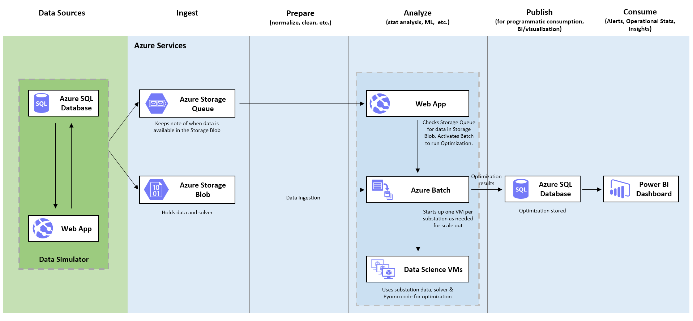
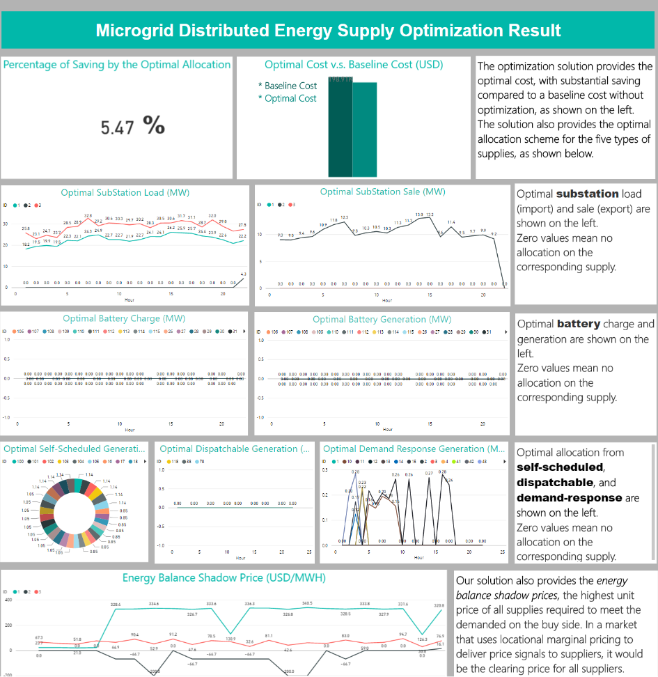

# Energy Supply Optimization Solution in Cortana Intelligence Suite

## Table of Contents

-   [Abstract](#abstract)

-   [Requirements](#requirements)

-   [Architecture](#architecture)

-   [Setup Steps](#setup-steps)

-   [Validation and Results](#validation-and-results)

-   [Customizing the Solution to Your Own Problem](#customizing-the-solution-to-your-own-problem)

## Abstract

This solution focuses on resource commitment optimization within the energy sector. An energy grid consists of energy consumers, as well as various types of energy supplying, trading, and storage components: Substations accepts power load or exports excessive power; Batteries may discharge energy or store it for future use; Windfarms and solar panels (self-scheduled generators), micro-turbines (dispatchable generators), and demand response bids can all be engaged to satisfying the demand from the consumers. The costs of soliciting different types of resources vary, and the capacities and the physical characteristics of each resource type limit the dispatch of its resource. Given all these constraints, the smart grid operator
must determine how much energy each type of the resources should commit over a time frame, so that the forecasted energy demand from the grid are satisfied. This solution using Cortana Intelligence enables smart grid operators to quickly introduce resource commitment optimization technology into their business.

This solution combines several Azure services to provide powerful advantages. Upon receiving the demand forecast and specification data for different types of resources into a Azure Blob Storage, together with a triggering message in Azure Queue Storage, an Azure Web App provisions an Azure Batch of Data Science Virtual Machines that perform the numerical optimization problems defined by the input data. The results are stored in Azure SQL Database and visualized in PowerBI.

The published [[Solution]](https://go.microsoft.com/fwlink/?linkid=831187) provides one-click deployment of this resource commitment optimization solution in Cortana Intelligence Suite. Advanced analytics solution implementers, i.e. Data Scientists and Data Engineers, usually need deeper understanding of the template components and architecture in order to use, maintain, and improve the solution. This documentation provides more details of the solution and step-by-step deployment instructions. Going through this manual deployment process will help implementers gain an inside view on how the solution is built and the function of each component.

## Requirements

You will need the following accounts and software to create this solution:

-   Source code and instructions from this GitHub repo

-   A [Microsoft Azure subscription](https://azure.microsoft.com/)

-   A Microsoft Office 365 subscription for Power BI access

-   A network connection

-   [SQL Server Management Studio](https://msdn.microsoft.com/en-us/library/mt238290.aspx), [Visual Studio](https://www.visualstudio.com/en-us/visual-studio-homepage-vs.aspx),
    or another similar tool to access a SQL server database.

-   [Microsoft Azure Storage Explorer](http://storageexplorer.com/)

-   [Power BI Desktop](https://powerbi.microsoft.com/en-us/desktop)

It will take about one day to implement this solution if you have all the required software/resources ready to use.

## Architecture

The figure above shows the overall architecture of the Energy Resource Optimization solution.

-  The sample data is streamed by newly deployed **Azure Web Jobs**.

-  This synthetic data feeds into the **Azure SQL**, that will be used in the
    rest of the solution flow.

-  The **Azure Batch** service together with **Data Science Virtual Machines** is used to optimize the energy supply from a particular resource type given the inputs received.

-  **Azure SQL Database** is used to store the optimization results received from the **Azure Batch** service. These results are then consumed in the **Power BI** dashboard.

-  **Azure Data Factory** handles orchestration, and scheduling of the hourly model retraining.

-  Finally, **Power BI** is used for results visualization.

This architecture is an example that demonstrates one way of building energysupply optimization solution in Cortana Intelligence Suite. User can modify the architecture and include other Azure services based on different business needs.

## Setup Steps

This section walks the readers through the creation of each of the Cortana Intelligence Suite services in the architecture defined in Figure 1. As there are usually many interdependent components in a solution, Azure Resource Manager enables you to group all Azure services in one solution into a [resource group](https://azure.microsoft.com/en-us/documentation/articles/resource-group-overview/#resource-groups). Each component in the resource group is called a resource. We want to use a common name for the different services we are creating. The remainder of this document will use the assumption that the base service name is:

energyopttemplate[UI][N]

Where [UI] is the users initials and N is a random integer that you choose. Characters must be entered in in lowercase. Several services, such as Azure Storage, require a unique name for the storage account across a region and hence this format should provide the user with a unique identifier. So for example, Steven X. Smith might use a base service name of *energyopttemplatesxs01*

**NOTE:** We create most resources in the South Central US region. The resource availability in different regions depends on your subscription. When deploying you own resources, make sure all data storage and compute resources are created in the same region to avoid inter-region data movement. Azure Resource Group don’t have to be in the same region as the other resources. Azure Resource Group is a virtual group that groups all the resources in one solution.

### 1. Create a new Azure Resource Group

-   Navigate to **portal.azure.com** and log in to your account

-   On the left tab click **Resource Groups**

-   In the resource groups page that appears, click **Add**

-   Provide a name **energyopttemplate\_resourcegroup**

-   Select a **location**. Note that resource group is a virtual group that groups all the resources in one solution. The resources don’t have to be in the same location as the resource group itself.

-   Click **Create**

### 2. Setup Azure Storage account

An Azure Storage account is used to put the raw data file which are written by Webjobs and read by Azure Batch.

-   Navigate to **portal.azure.com** and log in to your account.

-   On the left tab click **+ (New) \> Storage \> Storage Account**

-   Set the name to **energyopttemplate[UI][N]**

-   Change the **Deployment Model** to **Resource manager**

-   Set the resource group to the one we created, by selecting the radio button **Use existing**

-   Location set to South Central US

-   Click **Create**

-   Wait for the storage account to be created

Now that the storage account has been created we need to collect some information about it for other services like Azure Data Factory.

-   Navigate to **portal.azure.com** and log in to your account

-   On the left tab click Resource Groups

-   Click on the resource group we created earlier **energyopttemplate\_resourcegroup**. If you don’t see the resource group, click **Refresh**

-   Click on the storage account in Resources

-   In the Settings tab on the right, click **Access Keys**

-   Copy the PRIMARY CONNECTION STRING and add it to the table below

-   Copy the Primary access key and add it to the table below

| **Azure Storage Account** |                          |
|---------------------------|--------------------------|
| Storage Account Name      | energyopttemplate[UI][N] |
| Connection String         |                          |
| Primary access key        |                          |

### 3. Setup Azure SQL Server and Database

[Update]
In this step, we will create three Azure SQL Database to store “actual” demand data generated by the data generator and optimization results. The data in Azure SQL Database are consumed by Power BI to visualize optimize results and performance.

In this step, we will create an Azure SQL Database to store “actual” demand data generated by the data generator and forecasted demand data generated by Azure Machine Learning experiment. The data in Azure SQL Database are consumed by Power BI to visualize optimize results and performance.

#### Create Azure SQL Server and Database

-   Navigate to **portal.azure.com** and login in to your account

-   On the left tab click **+ (New) \> Databases \> SQL Database**

-   Enter the name **energyopttemplatedb** for the database name

-   Choose the resource group previously created
    **energyopttemplate\_resourcegroup**

-   Under Server click the arrow and choose **Create new server**

    -   Name : energyopttemplate[UI][N]

    -   Enter in an administrator account name and password and save it to the table below.

    -   Choose South Central US as the location to keep the SQL database in the same region as the rest of the services.

    -   Click **Select**

-   Once returned to the SQL Database tab, click **Create**

-   Wait for the database and server to be created. This may take few minutes.

-   From **portal.azure.com**, click on Resource Groups, then the group for this demo **energyopttemplate\_resourcegroup**.

-   In the list of resources, click on the SQL Server that was just created.

-   Under **Settings** for the new server, click **Firewall** and create a rule called **open** with the IP range of 0.0.0.0 to 255.255.255.255. This will allow you to access the database from your desktop. Click **Save.**

-   **Note**: This firewall rule is not recommended for production level systems but for this demo is acceptable. You will want to set this rule to the IP range of your secure system.

- Click on overview on the left blade.

- Create the second database by clicking **New Database** On the right panel top
    - Database name : Dso
    - Server : energyopttemplate\[UI][N]
    - Click **OK**

- Create the third database by clicking **New Database** On the right panel top
    - Database name : MarketPlace
    - Server : energyopttemplate\[UI][N]
    - Click **OK**

-	Launch ***SQL Server Management Studio(SSMS)***, or a similar tool, and connect to the database with the information you recorded in the table below.
	-	NOTE: The server name in most tools will require the full name:                             
energyopttemplate\[UI][N].database.windows.net,1433
	-	NOTE: Choose SQL Server Authentication

-	**THESE INSTRUCTIONS ARE FOR SSMS**
	-	Click on the ***energyopttemplatedb*** that you created on the server.
	-	Click ***New Query*** at the tool bar.
	-	Copy and execute the SQL script located in the package file *** [EnergyOpt.sql](https://github.com/Azure/cortana-intelligence-energy-supply-optimization/blob/master/Manual%20Deployment%20Guide/SQL/EnergyOpt.sql) *** to create the necessary table for storing the optimizer results.

  	-	Click on the ***Dso*** that you created on the server.
	-	Click ***New Query*** at the tool bar.
	-	Copy and execute the SQL script located in the package file *** [Dso.sql](https://github.com/Azure/cortana-intelligence-energy-supply-optimization/blob/master/Manual%20Deployment%20Guide/SQL/Dso.sql) *** to create the necessary table which are used by data simulator to generate simulated data.

  	-	Click on the ***MarketPlace*** that you created on the server.
	-	Click ***New Query*** at the tool bar.
	-	Copy and execute the SQL script located in the package file *** [MarketPlace.sql](https://github.com/Azure/cortana-intelligence-energy-supply-optimization/blob/master/Manual%20Deployment%20Guide/SQL/MarketPlace.sql) ***  to create the necessary table which are used by data simulator to generate simulated data.

**NOTE:** This firewall rule is not recommended for production level systems but for this demo is acceptable. You will want to set this rule to the IP range of your secure system.

| **Azure SQL Database** |                     |
|------------------------|---------------------|
| Server Name            |energyopttemplate[UI][N]|
| energyopttemplatedb Database               |energyopttemplatedb|
| Dso Database               |Dso|
| MarketPlace Database               |MarketPlace|
| User Name              |                     |
| Password               |                     ||

### 4. Create a Batch account 
Azure Batch is a platform service for running large-scale parallel and high-performance computing (HPC) applications efficiently in the cloud. In this solution, we will use Azure Batch to run the optimization model.

- Navigate to ***portal.azure.com*** and login in to your account

- Click **New** > **Compute** > **Batch Service**.

- The **New Batch Account** blade is displayed. See the descriptions below of each blade element.
     
  - **Account name**: ***energyopttemplate\[UI][N]***.
   
  - **Subscription**: Select the Subscription in which you have created resoures from step 1, 2 and 3.

  - **Pool allocation mode**: Select **Batch service**.
   
  - **Resource group**: Select **Use existing** and choose the resource group previously created ***energyopttemplate\_resourcegroup***.
   
  - **Location**: Choose South Central US as the location.
   
  - **Storage account** (optional): Click on Storage account. In the newly opened blade, select the Storage account we created in step 2. 

- Click **Create** to create the account.
   
   The portal indicates deployment is in progress. Upon completion, a **Deployments succeeded** notification appears in **Notifications**. Now that the Azure Batch account has been created we need to collect some information about.

- Navigate to ***portal.azure.com*** and log in to your account.

- On the left tab click Resource Groups.

- Click on the resource group we created earlier ***energyopttemplate_resourcegroup***. If you don’t see the resource group, click ***Refresh***.

- Click on the Azure Batch account in Resources.

- Under **Overview**, copy the URL displayed on the top of the new blade and save it in table below .

- Under Settings on left panel, go to **Keys**. Copy **Primary access key** and save it in table below. 

| **Azure Batch** |                     |
|------------------------|---------------------|
| Batch Account Name         |energyopttemplate\[UI][N]|
| Batch Primary Access Key   |\<Primary Access Key>|
| Batch Url              |                     ||

### 5. Setup Azure Web Job/Data Generator

In this step, we will create Azure Web App Server to run several Web Jobs including the Data Generator Web Jobs and few others.

#### 1) Create App Service and Service Plan
- Navigate to ***portal.azure.com*** and login in to your account.

- On the left tab click ***+ New > Web + Mobile > Web App***.

- Enter the name ***energyopttemplate\[UI][N]*** for the Web App name.

- Choose the resource group previously created ***energyopttemplate\_resourcegroup***.

- Under App Service plan click the arrow and choose ***Create New***.

    -   Name : energyopttemplate\[UI\]\[N\].

    -   Choose South Central US as the location to keep the Web App in the same region as the rest of the services.

    -   Click ***Ok***.

- On the Web App tab > App Insights, click ***On***.

- Click ***Create***.

- Wait for the Web App to be created.

#### 2) Update App Service Settings

- We need to set up the Application Service settings which our web jobs will utilize.

- From ***portal.azure.com,*** click on ***Resource Groups,*** then the group for this demo ***energyopttemplate\_resourcegroup.***

- In the list of resources, click on the Web App (App Service) that was just created.

- In the Web App (App Service), go to ***Settings > Application Settings***.

- Under ***General settings*** section, find ***Always On*** and turn it to ***On***. This setting is to make sure that the data simulator keeps running.

- Under ***App settings*** you will find two empty columns named ***Key*** and ***Value***.

    -   Enter following key value in the App Settings.

        | **Azure App Service Settings** |             |
        |------------------------|---------------------|
        | Key                    | Value               |
	    | SCM_COMMAND_IDLE_TIMEOUT        |5400 |
	    | WEBJOBS_IDLE_TIMEOUT         |5400 |
        | DB_SVR             |energyopttemplate[UI][N].database.windows.net|
	    | DB_SVR_Name             |energyopttemplate[UI][N]|	
        | DB_NAME           |energyopttemplatedb     |
        | DB_DSO         |Dso |
        | DB_MARKETPLACE         |MarketPlace |
        | DB_USR_NAME               | \<SQL Server user name>|
        | DB_PWD           |\<SQL Server password> |
        | BATCH_ACCT_NAME            |\<Batch Account Name from Step 4> |
        | BATCH_KEY            |\<Batch Primary Access Key from Step 4> |
        | BATCH_ACCT_URL           |\<Batch Url from Step 4> |
        | STORAGE_ACCT           |\<Storage Account Name from Step 2> |
        | STORAGE_KEY           |\<Primary access key from Step 2> |
        | BATCH_APP_CONTAINER           |batchappfiles |
        | BATCH_DATA_CONTAINER           |batchdatafiles |
        | INCOMING_MSG         |incomingmessages |
        | INCOMING_DATA         |incomingdatafiles |
        | StorageConnectionString         |\<Connection String from step 2> |
        | DataSimulator_Interval         |1 |

- Click ***Save*** on top of the page to save the settings

### 6. Upload Web Job

- Once you return to the App Service tab, click on ***WebJobs*** under ***Settings***.

##### 1) Add CreateBlobUploadData Web Job

- This web job created blob containers **batchappfiles,  batchdatafiles, incomingdatafiles** and a storage queue **incomingmessages**. It also loads the optimizer code to **batchappfiles** which is then used by AzureBatchWebJob while performing the optimization. 

    - **incomingdatafiles** container contains the raw data which is uploaded to here by EnergyResourceDataSimulator. 
    - EnergyResourceDataSimulator also writes a message to queue **incomingmessages** to let AzureBatchWebJob know about the availability of raw data . 
    - **batchappfiles** stores the optimizer code and dependent files. 
    - AzureBatchWebJob moves the raw data from incomingdatafiles container to **batchdatafiles** and then initiates Azure batch which uses raw data for optimization.

- Click ***Add*** on top to upload the CreateBlobUploadData job zip and provide following details:

     - Name : CreateBlobUploadData

      - File Upload : browse to the directory where you downloaded the resource. Go to [*WebJobs*](WebJobs/) and select ***CreateBlobUploadData.zip***.

      - Type : Triggered

      - Triggers : Manual

      - Click ***Ok***

- Wait till the web job is added, then click refresh.

- Once you see the web job ***CreateBlobUploadData*** in the list, select it and click ***Run*** on the top of that tab.

- The job runs for approx. 3 minutes. Wait till the STATUS changes to Completed.

##### 2) Add installpkgs Web Job

- This web job installs necessary python packages on the web app server to run the AzureBatchWebJob.

- Click ***Add*** on top to upload the installpkgs job zip and provide following details:

     - Name : installpkgs

      - File Upload : browse to the directory where you downloaded the resource. Go to [*WebJobs*](WebJobs/) and select ***installpkgs.zip***.

      - Type : Triggered

      - Triggers : Manual

      - Click ***Ok***

- Wait till the web job is added, then click refresh.

- Once you see the web job ***installpkgs*** in the list, select it and click ***Run*** on the top of that tab.

- The job runs for approx. 6 minutes. Wait till the STATUS changes to Completed.

##### 3) Add EnergyResourceDataSimulator Web Job
- This web job simulates the data and stores it to incomingdatafiles container. It also writes a message in the incommingmessage queue. It uses tables in database Dso and MarketPlace to generate the rawdata
- Click ***Add*** on top to upload the Energy data generator job zip and provide following details:

     - Name : EnergyResourceDataSimulator

      - File Upload : browse to the directory where you downloaded the resource. Go to [*WebJobs*](WebJobs/) and select ***EnergyResourceDataSimulator.zip***.

      - Type : Triggered

      - Triggers : Manual

      - Click ***Ok***

- Wait till the web job is added, then click refresh.

- Once you see the web job ***EnergyResourceDataSimulator*** in the list, select it and click ***Run*** on the top of that tab.

- The job runs for approx. 10 minutes. Wait till the STATUS changes to Running. This jobs goes to sleep for 60 mins after every run. The status still remains running.  

##### 4) Add AzureBatchWebJob Web Job
- This web job monitors the incommingmessage queue and once it finds messages in the queue, it moves the raw data from incommingdatafiles to batchdatafiles, creates Azure Batch and submits job to the Azure batch cluster. The job runs optimization code on batch nodes and it writes the result back to the SQL Database energyopttemplatedb.
- Click ***Add*** on top to upload the AzureBatchWebJob job zip and provide following details:

     - Name : AzureBatchWebJob

      - File Upload : browse to the directory where you downloaded the resource. Go to [*WebJobs*](WebJobs/) and select ***AzureBatchWebJob.zip***.

      - Type : Continuous

      - Scale : Single Instance

      - Click ***Ok***

- Wait till the web job is added, then click refresh.

- Once you see the web job ***AzureBatchWebJob*** in the list, it will start running and the status will change to Running.

- Wait till the STATUS changes to Running. As this is a contineous job, it will run always.

### 7. Setup Power BI
The essential goal of this part is to get the optimization results and visualize it. Power BI can directly connect to an Azure SQL database as its data source, where the optimization results are stored.

> Note:  1) In this step, the prerequisite is to download and install the free software [Power BI desktop](https://powerbi.microsoft.com/desktop). 2) We recommend you start this process 1-2 hours after you finish deploying the above steps, so that you have more data points to visualize.

#### 1) Get the database credentials.

  You can get your database credentials from step 3 when you are setting up the SQL database.

#### 2)	Update the data source of the Power BI file

  -  Make sure you have installed the latest version of [Power BI desktop](https://powerbi.microsoft.com/desktop).

  -	In this GitHub repository, you can download the **'ResourceOptimization.pbix'** file under the folder [*Power BI*](Power BI/) and then open it. **Note:** If you see an error massage, please make sure you have installed the latest version of Power BI Desktop.

  - Open the downloaded ResourceOptimization.pbix and cancle the popup windows.

 - On the top of the file, click **‘Edit Queries’** drop down menu. Then choose **'Data Source Settings'**.
  

  - In the pop out window, click **'Change Source'**, then replace the **"Server"** and **"Database"** with	your own server and energyopttemplatedb database names and click **"OK"**. For server name, make sure you specify the port 1433 in the end of your server string (**YourSolutionName.database.windows.net, 1433**). After you finish editing, close the 'Data Source Settings' window.

  - On the top of the screen, you will see a message. Click **'Apply Changes'**. When you are asked to enter the user name and password, make sure you choose **'Database'** option, then enter the username and password that you choose when you setting up the SQL database.

  - Now the dashboard is updated to connect to your database. In the backend, model is scheduled to be refreshed every 1 hour. You can click **'Refresh'** button on the top to get the latest visualization as time moving forward.

#### 3) [Optional] Publish the dashboard to [Power BI Online](http://www.powerbi.com/)
  Note that this step needs a Power BI account (or Office 365 account).
  - Click **"Publish"** on the top panel. Choose **'My Workspace'** and few seconds later a window appears displaying "Publishing succeeded".

  - Click the link on the screen to open it in a browser. On the left panel, go to the **Dataset** section, right click the dataset *'ResourceOptimization'*, choose **Dataset Settings**. In the pop out window, click **Edit credentials** and enter your database credentials by following the instructions. To find detailed instructions, please see [Publish from Power BI Desktop](https://support.powerbi.com/knowledgebase/articles/461278-publish-from-power-bi-desktop).

  - Now you can see new items showing under 'Reports' and 'Datasets'. To create a new dashboard: click the **'+'** sign next to the
    **Dashboards** section on the left pane. Enter the name "Resource Optimization Demo" for this new dashboard.

  - Once you open the report, click    to pin all the visualizations to your dashboard. To find detailed instructions, see [Pin a tile to a Power BI dashboard from a report](https://support.powerbi.com/knowledgebase/articles/430323-pin-a-tile-to-a-power-bi-dashboard-from-a-report). Here is an example of the dashboard.

      

## Validation and Results

### Check Data in SQL Database
- Launch [SQL Server Management Studio](https://msdn.microsoft.com/en-us/library/mt238290.aspx)(SSMS), Visual Studio, or a similar tool, and connect to the database with the information you recorded in the table below.

    -   NOTE: The server name in most tools will require the full name:  
    energyopttemplate\[UI\]\[N\].database.windows.net,1433

    -   NOTE: Choose SQL Server Authentication

    -   From the dropdown list of Databases on the left panel under Object Explorer, select ***energyopttemplatedb*** that you created on the server

    -   Right click on the selected database and expand the tables

    -   Expand the Table and run queries to get better understanding of data

	
## Customizing the Solution to Your Own Problem

In order for your own mathematical problem  to be built as a solution pipeline like this one, two major changes to this pre-configured solution: The data source, and the suite of optimization job, solver, and the interface software.

### Bring your own data

To allow your own data to fit into this architecture, note that you simply need to ingest your data file(s) into the Azure Blob container "incomingdatafiles", together with a text message placed into the Azure Storage Queue "incomingmessages". They will automatically trigger the remaining components of the processing pipeline, and will be removed from the container and queue after the optimization job is finished. Given the time for the Azure Batch to provision the pool, configure the nodes, run the jobs, and destroy the pool, we recommend that the interval between two consecutive submissions to the container and queue is set to more than one hour. You may submit multiple files, each describing a complete set of data required for one optimization problem, and Azure Batch will assign each file to a separate node that will execute the job in parallel with other nodes handling other files.

In the pipeline you obtain from the automatic deployment, the data files and messages are simulated from webjob as defined by EnergyResourceDataSimulator.zip, together with two auxiliary databases "Dso" and "MarketPlace". Replace them with your own data source that may involve components other than webjob or database.

### Bring our own optimization suite

Your optimization suite should include code that describes the optimization problem, the solver, and the interface software that accommodates the optimization code into the solver. The automatically deployed pipeline has all three pieces in the Azure Storage container "batchappfiles": The python script "der_optimization_task.py" codes the problem, the binary executable "cbc.exe" serves as the solver, and the installation file "Pyomo-5.1.1-py2-none-any.whl" will install PYOMO on each node of the Batch pool. You should replace them by your own python script that run the optimization job, your own solver and its supporting files if it is not a standalone executable like CBC, and your coding interface software. They should all be hosted in the container "batchappfiles".

The container also contains a congifuration file "modelConfig.txt" that provide additional parameters or specifications of the optimization job, and you should feel free to replace it by something defined by your own problem, or discard it if it is unnecessary. 

The webjob as defined by "AzureBatchWebJob.zip" is the central controller: It spins up the batch pool, sets up the nodes, submits jobs to the nodes, and writes the results to SQL database. After you have customized the optimization suite, make changes to appropriate lines in the main procedure "webjob_trigger.py", so that the code correctly copies the materials from "batchappfiles" to the nodes, properly prepares the nodes, and successfully submits the jobs.

